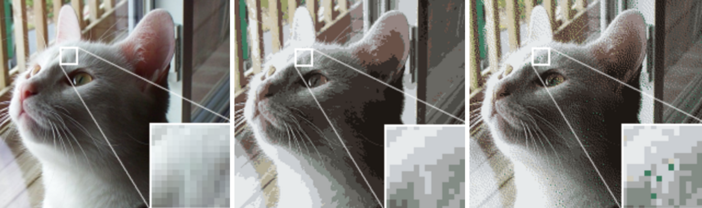

# ANTI-ALIASING
## AA Mode

**Anti-Aliasing Mode** is a Unity-specific, internally hidden setting. It has four presets:

- None
 
- FXAA (Fast Approximate AA)
 
- SMAA (Subpixel Morphological AA)
 
- TAA (Temporal AA)

AA Mode has **no noticeable performance impact**.

## AA Quality

Dictates the quality of the currently selected Anti-Aliasing mode.

This only matters when AA Mode is set to something other than None — the higher the quality tier, the more samples/passes the selected mode uses, at a proportionally higher GPU cost.

## Dithering

Dithering is an intentionally applied form of noise used to randomize quantization error, preventing large-scale patterns such as color banding in textures affected by AA.

