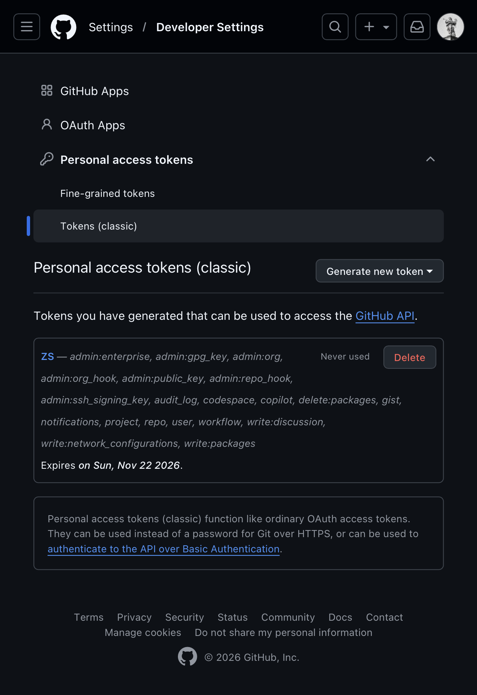
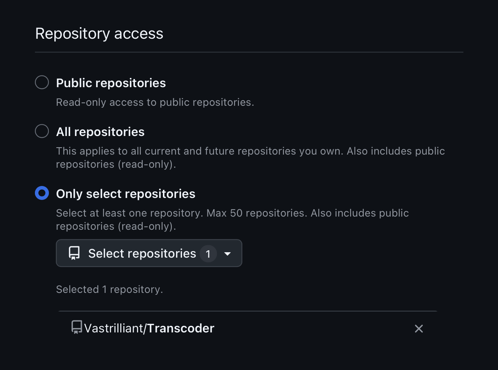
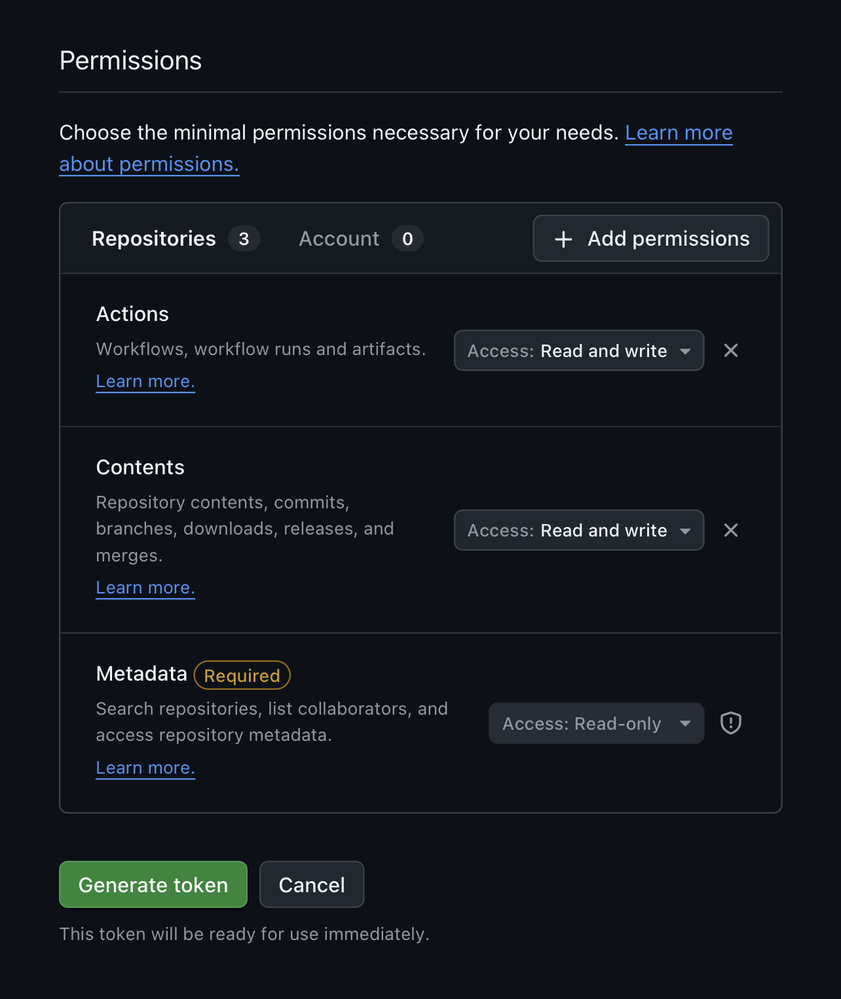
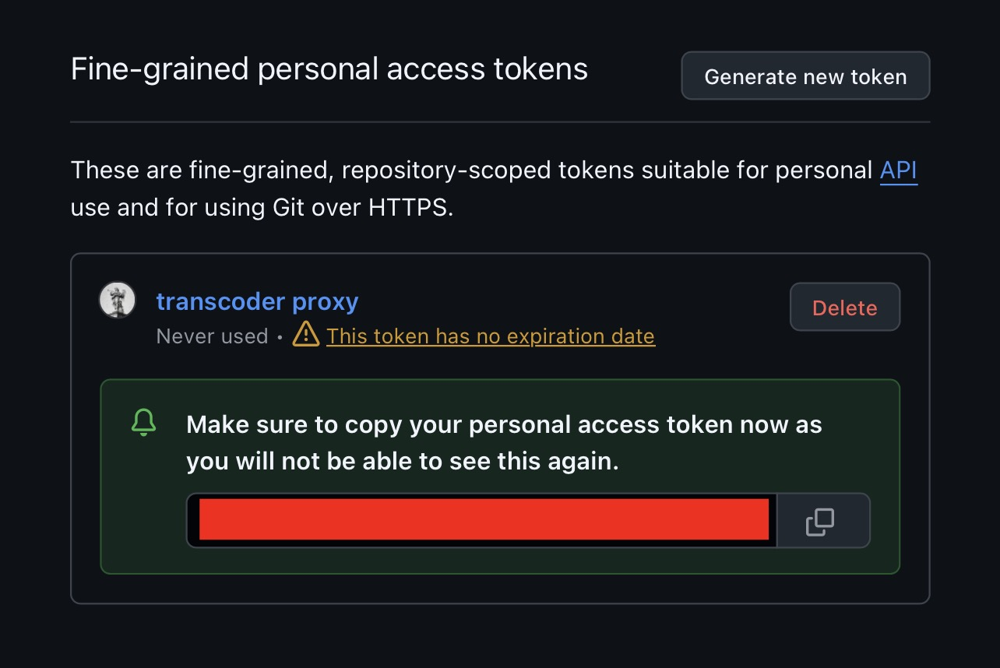

# AUTH
Authentication for the GitHub repository used by the [Transcoder pipeline](Mods.md#the-transcoder-pipeline) — both to run the transcoding workflow and to store/serve already-processed bundles.

## owner/repo

The target repository, in `owner/repo` form (e.g. `yourname/your-repo`).

## Personal Access Token

A GitHub Personal Access Token (`github_pat_XXXX…` or `ghp_XXXX…`), you'll need to provide this for ZSingularity to interact with your repo

To get your own personal access token, go to your GitHub account settings > developer settings > Personal Access Tokens

Generate a fine-grained, repo-scoped token. 

Select your transcoder proxy repo, see [Mods](mods.md) on how to set up

Give your token an expiration date - it’s best practice to give it a finite number of days for better security, set to no expiration if you don’t care.

Assign the token these permissions: 

- `Contents (Read / Write)`
- `Actions (Read / Write)`

Make sure to save your personal access token in a secure place. Once you configure it — you won’t be able to see it again. 

**NOTE: Do NOT share this token with anyone. Should you ever lose or have your personal access token compromised, rotate your tokens immediately.**

