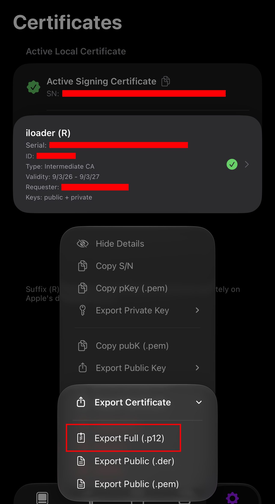

# PROVISIONING

**IF YOU'RE USING LIVECONTAINER'S TWEAKLOADER, YOU DON'T NEED THIS**

The backend on-device updating for standalone apps. 

New .dylibs must be signed under a valid certificate for them to be approved by AMFI (Apple Mobile File Integrity)

Otherwise, apps will crash due to an invalid signature (or lack thereof) triggering a `SIGKILL` 

You must provide a valid .p12 certificate, if you've sideloaded the app using Sidestore / LiveContainer+Sidestore, go to Sidestore's settings, and look for `Certificate Management`

Select your active certificate, and export as .p12
 

Sidestore will ask you to provide a password to encrypt the file

Fill out the Provisioning form in ZSingularity to unlock on-device updating.

**NOTE: Do NOT share your certificate with anyone.**