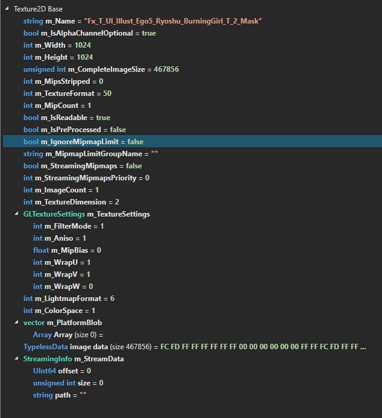

# RENDERING
## Render Scale

The game's rendering resolution scale.

Its values range from 0 to 1.00. The game's own settings menu only exposes a select range of presets:

- Low = 0.50
- Medium = 0.75
- High = 1.00

Keep in mind that lowering the Render Scale mid-game will rarely result in a significant memory reduction — you need to restart the game for the change to fully take effect.

## Battle RS 

Short for **Battle Render Scale**

This is a custom setting, by leveraging `isBattle=1`, ZSingularity can detect whenever a combat encounter is active, lowering the resolution to the desired value. 

## AP RS Mult

Short for **Adaptive Performance Render Scale Multiplier**.

This is an alternative render scale method primarily used by the Android (AOS) port of the game — it works through Unity's Adaptive Performance system rather than the normal engine render scale pipeline.

Its values range from 0 to 2.00 and multiply whatever render scale Adaptive Performance would otherwise choose on its own.

Setting this to anything other than its default of 1.00 automatically enables Adaptive Performance, since the multiplier has no effect unless Adaptive Performance is actively driving the render scale.

**NOTE: This setting is extremely unstable, do not change this value during a combat encounter, doing so will freeze the game, also do not set its value to 0.00, doing so, will also freeze the game**

## Texture MIP

Internally known as the Texture Mipmap Limit.

A mipmap is a pre-calculated, optimized sequence of images that accompanies a main texture. Each subsequent image in the sequence is exactly half the resolution (width and height) of the one before it — the engine picks whichever level looks best for how large the texture is currently being drawn on screen, so distant or small textures don't need to sample a full-resolution image.

The mipmap limit only affects `Texture2D` assets that contain generated mip map levels — those assets must also have the following properties:

```
int m_MipMapsStripped = 0
int m_MipCount = 1+
bool m_IgnoreMipmapsLimit = false
bool m_StreamingMipmaps = any*
int m_StreamingMipmapsPriority = 1± 
```



Very few `Texture2D` assets have the required values, **thus only a select few textures are affected by this setting** — most notably the 'chain' and 'battle' buttons found in the battle dashboard.

## MSAA

Also known as **Multi-Sample Antialiasing**.

This is a Unity-specific, internally hidden setting that Limbus doesn't expose — its default value is 2x.

**NOTE: It's still unclear whether this setting has any measurable effect in practice.**

## RT Memoryless

`RenderTextureMemoryless` is an optimization feature that allows you to render to a RenderTexture without backing it up in the main system RAM or VRAM. Instead, Unity temporarily stores the texture contents strictly inside the on-tile cache memory of the GPU during the rendering pass, completely discarding the data right after

This provides a massive memory optimization for Mobile devices, where VRAM bandwidth and footprint are tightly constrained

- Off — no render textures are marked memoryless.
- Depth — the depth buffer is marked memoryless.
- MSAA — the MSAA resolve buffer is marked memoryless.
- Depth+MSAA (Both) — both the depth buffer and the MSAA resolve buffer are marked memoryless.

NOTE: Memoryless RenderTextures are completely unreadable & unwritable functions like `Texture2D.ReadPixels()`, `Graphics.CopyTexture()` and compute shaders will fail. 

What this means is that Shaders & other Post-processing effects that rely on any of the above mentioned techniques will not be rendered

**Requires a game restart to fully take effect, some Textures may not be affected by this setting**