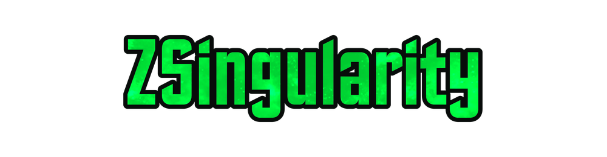
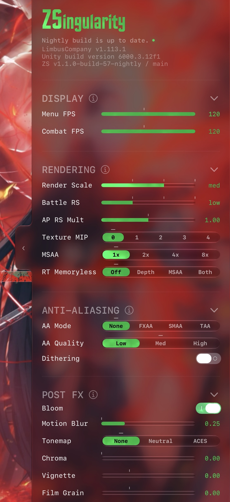
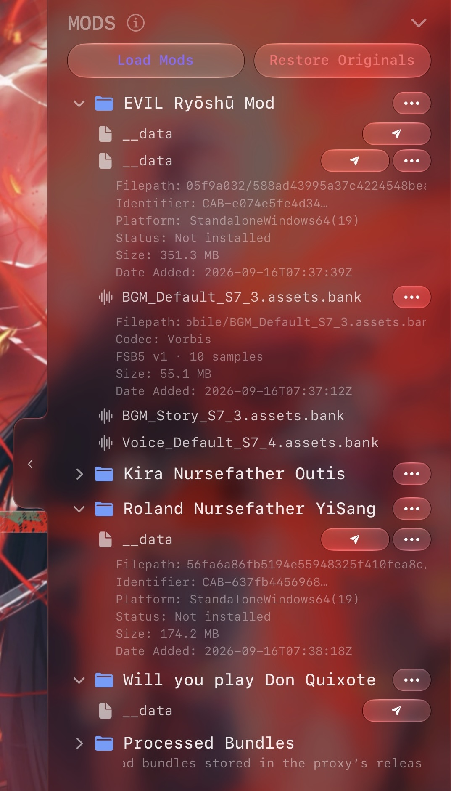

<div align="center">



[](https://discord.gg/nRmztE2unw)
[](https://github.com/Vastrilliant/ZSingularity/releases)

</div>

---
**ZSingularity** is a jailed iOS tweak for **Limbus Company** that gives you direct, fine-grained control over the game's graphical and performance settings by hooking into public classes exposed in Assembly-CSharp — settings the game's own menu never lets you touch.

Alongside that, it brings a **cosmetic mod loader** to iOS — a feature that's historically been desktop-only. Modded asset bundles are sent to a private GitHub repository running AssetTools.NET, re-encoded and re-targeted for mobile, then returned to the tweak and installed directly into the game.

Need some help, have a bug to report or want to suggest new features? [Join the Discord Server!](https://discord.gg/nRmztE2unw)

<p align="center">
  
  
</p>
## Features

Adjust various graphical settings such as: 

- FPS
- Render Scale 
- Anti-Aliasing 
- MSAA
- Texture MIP
- Particles 
- Bloom 
- Motion Blur

And many Quality-Of-Life settings that aim to give you a better experience 

ZSingularity also features a fledged Mod Loader & Asset manager optimized for mobile, load and bookkeep your mods with ease

Supported Mods:
- __data Unity asset bundles
- assets.bank FMOD audio banks
- Lunartique.zip mod format
- .carra2 mod format

Planned:
- Custom translation support
- Custom announcers
## Installation

**Pre-built ipa is available in the [Discord Server](https://discord.gg/nRmztE2unw)**

Download a decrypted .ipa of Limbus Company through your decryption service of choice, fork this repository and use `build-ipa.yml` to inject ZSingularity into your .ipa

You must modify the .ipa’s `info.plist` to get all of ZSingularity’s functionality

Add the following key’s to your .ipa’s `info.plist`
```
<key>CADisableMinimumFrameDurationOnPhone</key>
<true/>
<key>CADisableMinimumFrameDuration</key>
<true/>
<key>LSSupportsGameMode</key>
<true/>
<key>LSSupportsOpeningDocumentsInPlace</key>
<true/>
<key>UIFileSharingEnabled</key>
<true/>
```
To install, **[SideStore](https://sidestore.io/)** is recommended, follow the steps provided in their Documentation

A PC is recommended for the smoothest installation process, otherwise you may use **[Sideinstaller](https://sideinstaller.net)** (iOS27+ only)

> [!WARNING]
>You will not be able to install updates from the AppStore, every time Limbus updates you’ll need to manually sideload the new version into your device 
>
>You won’t be able to make any app purchases in a sideloaded version of LimbusCompany
>
>You won’t be able to login to your limbus account thru Apple ID

## Legal, Liability & Usage Notice

ZSingularity is an independent, fan-made project and is **not affiliated with, endorsed by, or supported by Project Moon**. Limbus Company and all related assets are the property of their respective owners.

While no bans or account restrictions have been issued for visually modding the game or using similar tools, it is always best to be cautious.

This tweak modifies the game client's rendering and, via its mod loader, its asset bundles. Using it may violate Project Moon's Terms of Service, and any account-level consequences (including but not limited to warnings, restrictions, or bans) are **your own responsibility**. Use it at your own risk.

This software is provided **"as is," without warranty of any kind**, express or implied. The authors and contributors are not liable for any damages, data loss, account action, or other harm arising from the use or misuse of this tweak.
